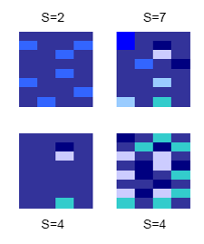

```{r setup, include=FALSE}
# tidy R chunks.
knitr::opts_chunk$set(echo = TRUE, tidy=FALSE, tidy.opts=list(blank=FALSE, width.cutoff=50))
# R console width
options(width=50)
# Install necessary packages only
InstallPackages <- function(Packages) {
  sapply(Packages, function(Package) 
    if (!Package %in% installed.packages()[, 1]) install.packages(Package, repos="https://cran.rstudio.com/"))
}
InstallPackages(c("tidyverse", "formatR", "remotes", "entropart"))
remotes::install_github("EcoFoG/EcoFoG")
# Tidiverse default options
library("tidyverse")
# Set ggplotting to bw plot default, but with transparent background elements.  
theme_set(theme_bw(base_size=12))
theme_update(panel.background = element_rect(fill = "transparent", colour = NA),
             plot.background = element_rect(fill = "transparent", colour = NA))
knitr::opts_chunk$set(dev.args=list(bg="transparent"))
# Tibbles: 5 lines, fit to slide width
options(tibble.print_min = 5, tibble.width = 50)
```

# Motivation

## The Questions

Which diversity metrics make more sense than mere indices?

Which of them may be less sensitive to metabarcoding issues?


## Diversity of what?

Usually species (definition of E.O. Wilson).

May be any partitioned set.

\

Usually species in a clade (or a group), considered as a community: e.g. trees in a forest habitat.

\

Usually asymptotic diversity of a community that does not exist physically.


## Course material

- Book: Marcon, E. (2017). Mesures de la Biodiversité. Kourou, France: UMR EcoFoG. https://hal-agroparistech.archives-ouvertes.fr/cel-01205813

- English version: https://github.com/EricMarcon/BDmeasurement

- R package entropart [@Marcon2014c]


# Neutral diversity

## Richness and Evenness

```{r, echo=FALSE, out.width='40%'}

```

Which is the most diverse community?


## Measuring Complexity

Define a character string:

- Length $n$

- Each letter has a probability

Example: 

- 3 letters, \{a, b, c\},  probabilities (1/2, 1/3, 1/6)

- How many 60-character strings?

- The logarithm of the number of strings is $n$ times entropy: $`r format(60*entropart::Shannon(c(1/2, 1/3, 1/6), CheckArguments=FALSE), digits=2)`$

Shannon's entropy measures the _complexity_ of the distribution of  \{a, b, c\}, independently of $n$: `r format(entropart::Shannon(c(1/2, 1/3, 1/6), CheckArguments=FALSE), digits=3)`


## Entropy in Information Theory

An experiment with several outcomes:

- The probability to obtain $r_s$ is $p_s$.

Information function: $I(p_s)$, between $I(0)=+\infty$ and $I(1)=0$.

- Definition: rarity is $1/p_s$.

- The logarithm of rarity is Shannon's information function.

The expectation of the information carried by an individual is Shannon's entropy:
$$\sum_s{p_s \ln {\frac{1}{p_s}}}$$
The average information is equivalent to complexity.


## Generalized Entropy

Other entropies: Rényi, Shorrocks... @Tsallis1988

Parametric, to focus on rare or abundant species.

Deformed logarithm: $\ln_q x = \frac{x^{1-q} -1}{1-q}$

```{r lnq, echo=FALSE, out.width='75%'}
library("entropart")
curve(log(1/x), 0, 1, lty=1, lwd=2, ylab = expression(ln[q](1/x)))
curve(lnq(1/x, 0), 0, 1, lwd=2, lty = 2, add = TRUE)
curve(lnq(1/x, 2), 0, 1, lwd=2, lty = 3, add = TRUE)
legend("topright", 
      legend = c(expression(ln[0](1/x)), "ln(1/x)",
      expression(ln[2](1/x))),
      lty = c(2, 1, 3, 4), inset=  0.02)
```


## Tsallis (HCDT) Entropy 1/2

```{r plnq, echo=FALSE, out.width='75%'}

curve(x*log(1/x), 0, 1, lty=1, lwd=2, ylab = expression(x.ln[q](1/x)), ylim=c(0,1))
curve(x*lnq(1/x, 0), 0, 1, lwd=2, lty = 2, add = TRUE)
curve(x*lnq(1/x, 2), 0, 1, lwd=2, lty = 3, add = TRUE)
legend("topright", 
      legend = c(expression(x.ln[0](1/x)), "x.ln(1/x)",
      expression(x.ln[2](1/x))),
      lty = c(2, 1, 3, 4), inset=  0.02)
```

Contribution of a species to entropy of order $q=0, 1, 2$.


## Tsallis (HCDT) Entropy 2/2

Tsallis entropy is the average (deformed, of order $q$) logarithm of rarity [@Tsallis1994]

The order $q$ stresses small or high probabilities.

- Entropy of order 0: the number of species -1.

- Entropy of order 1: Shannon.

- Entropy of order 2: Simpson.


## Hill Numbers

The number of equiprobable outcomes that have the same entropy as the observed system [@Hill1973]: _effective number of species_.

They are the (deformed, of order $q$) exponential of entropy [@Marcon2014a].
$$e^x_q = [1 + (1-q)x]^{1/(1-q)}.$$

Diversity is noted $^{q}D(\mathbf{p_s})$.


## Diversity Profiles

A diversity profile is $^{q}D$ ~ $q$.

Compare two communities:

```{r Paracou618, echo=FALSE, out.width = "70%"}
q.seq <- seq(0, 2, .1)
P6D<- CommunityProfile(Diversity, Paracou618.MC$Nsi[,1], q.seq)
P18D<- CommunityProfile(Diversity, Paracou618.MC$Nsi[,2], q.seq)
plot(P6D, xlab="q", ylab="Diversity", main="", ylim=c(min(P6D$y), max(P18D$y)))
lines(P18D, lty=2)
legend("topright", 
      legend = c("Paracou 6", "Paracou 18"),
      lty = c(2, 1, 3, 4), inset=  0.02)
```

## Summary

Entropy is the average log of rarity:

$$^{q}H(\mathbf{p_s}) = \sum_{s}{p_s \ln_q{(1/p_s)}}$$

Diversity is its exponential:

$$^{q}D(\mathbf{p_s}) = e_q^{^{q}H(\mathbf{p_s})}$$


# Estimation

## Estimation bias

Rare species are difficult to sample

$\rightarrow$ diversity is generally underestimated.

\

Sampling effort is measured by $n$, the sample size.

The estimation bias decreases with $n$ and $q$.

Simpson diversity is almost unbiased if $n/(n-1) \approx 1$.


## Estimation of richness

High bias but easiest correction methods.

Jackknife 1 estimator: just add the number of singletons $S_1$.

Correct if sample completeness > 3/4, i.e. singletons are less than 1 species out of 4.

Example: 225 species including 19 singletons $\rightarrow$ 244 species.


## Estimation of diversity

Many estimators of entropy, most based on sample coverage. See section 4.6 of the book.

Entropy is estimated, then transformed to diversity.

Sample coverage is the probability of an individual of the community to belong to a sample species.

Far more than sample completeness.

Estimated by $$\hat{C} = 1 - \frac{S_1}{n}.$$


## Practical estimation

All estimators available in _entropart::Diversity_.

Rule of thumb:

- Chao-Wang-Jost estimator is the best if singletons are less than 1 species out of 4.

- Else, the unveiled estimator chooses the appropriate Jackknife estimator for richness and is less biased but has higher variance.


# Practical 1

## Data

Use Paracou forest tree inventory (2016).

```{r}
library("EcoFoG")
Paracou2df("Plot=6 AND CensusYear=2016") %>% # Année 2016
  # Arbres vivants seulement
  filter(CodeAlive == TRUE) %>% 
  # Filtrage des colonnes utiles
  select(Plot, SubPlot:Yfield, -Project, -Protocole, Family:Species, CircCorr) %>%
  # Création d'une colonne contenant "Genre espèce".
  unite(col = spName, Genus, Species, remove = FALSE) -> Paracou
```

Summarize the list of trees into abundance table.
First prepare a species name field.

```{r}
Paracou %>%
  unite(col = spName, Genus, Species, remove = FALSE) %>% 
  group_by(SubPlot, spName) %>% 
  summarize(Abundance = length(Species)) ->
  AbundancesP6
```

Prepare a named vector for plot 6 data.
```{r}
AbdP6 <- AbundancesP6$Abundance
names(AbdP6) <- AbundancesP6$spName
```

## Richness

Number of species in plot 6.

```{r}
library("entropart")
AbdP6 %>% Richness(Correction="None")
```
Number of singletons in plot 6.

```{r}
sum(AbdP6 == 1)
```

Estimation.

```{r}
AbdP6 %>% Richness(Correction="Jackknife")
```

## Sample coverage

```{r}
Coverage(AbdP6)
```

More than 1/3 of species are not observed but they contain less than 3% of the number of trees.


## Diversity Profile

Unveiled-Jackknife estimator.
```{r, out.width='80%'}
CommunityProfile(Diversity, AbdP6, Correction="UnveilJ") %>% 
  autoplot
```


# Partitioning Diversity

## $\alpha$, $\beta$ and $\gamma$ diversity

Defined by @Whittaker1972:

- $\alpha$: Average richness of a set of habitats, i.e. $\bar{S}$ species per habitat.
- $\gamma$: Richness of the assemblage, i.e. $S$ species
- $\beta$: The ratio $\gamma / \alpha$, i.e. a number of habitats.

Extensions to:

- All orders of diversity.
- Any embedded spatial scales.


## The controversy

After @Lande1996: additive partitioning of diversity.

Resolution:

- $\beta$ diversity = the ratio $\gamma / \alpha$.
- $\beta$ entropy = the difference $\gamma - \alpha$.

Exponentials multiply, logs sum...


## Effective number of communities

$\alpha$ diversity at the community level is an effective number of species / community.

$\gamma$ diversity at the assemblage ("meta-community") level is an effective number of species.

$\rightarrow \beta$ diversity is an effective number of communities.


## Effective number of communities

```{r DivPart}
summary(DivPart(q = 1, MC = Paracou618.MC, 
                Biased=FALSE, Correction="UnveilJ"))
```

## Diversity profile

```{r Divprofile}
plot(DivProfile(MC = Paracou618.MC, 
                Biased=FALSE, Correction="UnveilJ"))
```


## Relative Entropy 

Departure of the observed distribution from the expected distribution [@Kullback1951's divergence].

Generalization to order $q$ [@Marcon2014a].

If the expected distribution is the average distribution (that of the assemblage) then the relative entropy is the difference between the entropy of the assemblage ($\gamma$) and that of each community ($\alpha$): it is $\beta$ entropy.

Useless but important.


## Differentiation vs Proportional Diversity

This definition of $\beta$ diversity measures the average departure of a community from the meta-community.

$\rightarrow$ Proportional Diversity.

Other measures exist to define how different two communities are from each other.

$\rightarrow$ Differentiation Diversity.

# Practical 2

## Data

Formatting the data as a dataframe, species in lines, subplots in columns.

```{r}
AbundancesP6 %>% 
  spread(key = SubPlot, value = Abundance, fill=0) %>% 
  as.data.frame -> df
# Name rows and columns
rownames(df) <- df$spName
df <- df[, -1]
colnames(df) <- paste("P", colnames(df), sep="")
# Create a MetaCommunity object
ParacouMC <- MetaCommunity(df, Weights = colSums(df))
```

## Diversity Profile

```{r}
dp <- DivProfile(, ParacouMC, 
                 Biased = FALSE, Correction="UnveilJ")
autoplot(dp)
```

# Phylogenetic diversity

## Ultrametric phylogeny

```{r, echo=FALSE, out.width='80%'}
knitr::include_graphics("images/Arbre.pdf")
```

## Phylogenetic Entropy and Diversity

Entropy sums along the tree.

Diversity is its exponential [@Marcon2014b].
It is the number of equiprobable species in a star phylogeny of height 1.

$\rightarrow$ Estimate entropy along the tree, average it, transform the phyloentropy into phylodiversity.


## Phylogenetic Diversity

Phylogenetic diversity of order 0 is called PD. It reduces to richness in a star tree of height 1.

Phylogenetic entropy of order 2 is Rao's quadratic entropy. It reduces to Simpson's entropy in a star tree of height 1.


# Practical 3

## Data

Make a taxonomic tree.

```{r, tidy=FALSE, message=FALSE}
library("ape")
library("magrittr")
Paracou %>%
  filter(Plot == 6) %>% 
  select(Family:Species) %>% 
  unite(col=spName, Genus, Species, remove=FALSE) %>% 
  mutate_if(is.character, as.factor)  %>% 
  {as.phylo(~Family/Genus/spName, data=., collapse=FALSE)} %>% 
  compute.brlen(method=1) %>% 
  collapse.singles %>% 
  multi2di %T>% 
  plot(show.tip.label = FALSE) -> p6Phylo
```


## Diversity Profile

Same estimator as that of neutral diversity.

```{r, out.width='70%', cache=TRUE}
dp <- CommunityProfile(function(Abd, q, CheckArguments) 
  PhyloDiversity(Abd, q, Correction="UnveilJ", Tree=p6Phylo)$Total,
  AbdP6)
autoplot(dp)
```


# Functional Diversity

## Functional space

Distance between species are not ultrametric.

Metrics based on the distance matrix.

No time here: see part 3 of the book.


# Conclusion

## Entropy to unify diversity measures

```{r, echo=FALSE, out.width='80%'}
knitr::include_graphics("images/ConclusionFig.pdf")
```

## Metabarcoding

Satisfactory results when supervised clustering is possible (but no estimation bias correction available)

Risky results with unsupervised clustering. 
Seems to work quite well around Shannon's diversity.


## References

\tiny


